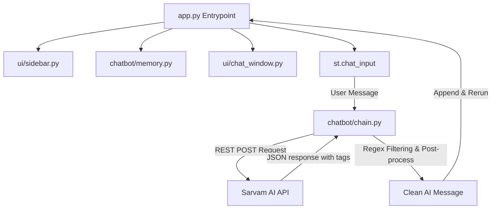

# 🤖 Simple LangChain Chatbot

[](https://www.python.org/)
[](https://streamlit.io/)
[](https://www.langchain.com/)
[](https://www.sarvam.ai/)
[](https://opensource.org/licenses/MIT)

A modern, responsive, and lightweight conversational AI chatbot built with **Streamlit** and **LangChain**, utilizing **Sarvam AI's** powerful `sarvam-m` language model for contextual multilingual chat.

---

## 🌟 Key Features

* **Interactive Conversational UI**: Built using Streamlit's sleek and modern chat components (`st.chat_input` and `st.chat_message`) for smooth interactions.
* **LangChain Orchestration**: Modular architectural layout built to easily expand into retrieval-augmented generation (RAG) and complex chain structures.
* **Sarvam AI Integration**: Accesses the state-of-the-art `sarvam-m` LLM via its robust REST API for highly contextual, performant, and multilingual chat responses.
* **Automated Reasoning Tag Stripping**: Features smart regex post-processing to clean raw model output and strip internal reasoning tags (like `<think>...</think>`) before displaying responses to the user.
* **Session-State Memory**: Keeps track of message exchanges during the active session.
* **Intuitive Sidebar Controls**: Quick actions let users view application settings or instantly wipe the chat history and reset context memory with a single click.
* **Robust Exception Handling**: Graceful client-side recovery from API timeouts, lack of connectivity, and HTTP server errors.

---

## 🏗️ Architecture & Project Directory Map

The codebase is organized in a modular structure to maintain a clear separation of concerns between state management, API interaction, and UI presentation components:

```text
Chatbot/
│
├── README.md                  # Comprehensive documentation (this file)
└── my-chatbot/                # Main application package
    ├── app.py                 # Application entrypoint (Streamlit app orchestration)
    ├── requirements.txt       # Python package dependencies list
    ├── .env.example           # Configuration template for local environment variables
    ├── .env                   # Secret credentials & API keys (git-ignored)
    ├── .gitignore             # Git ignore patterns
    │
    ├── chatbot/               # LLM interaction & system state layer
    │   ├── __init__.py        # Package constructor
    │   ├── chain.py           # Sarvam AI API client integration & prompt cleanup logic
    │   ├── config.py          # Environment loader exposing configuration constants
    │   └── memory.py          # Session-state memory initializes and managers
    │
    └── ui/                    # Presentation components layer
        ├── __init__.py        # Package constructor
        ├── chat_window.py     # Custom messages visual renderer
        └── sidebar.py         # Side panel configuration controls
```

### Flow Diagram



---

## 💻 Tech Stack & Dependencies

* **Core Language**: `Python 3.9+`
* **Frontend UI Framework**: `Streamlit`
* **Application Framework**: `LangChain` & `LangChain-Community`
* **Network & Requests**: `requests` for fast, lightweight API integration
* **Environment Configuration**: `python-dotenv` for managing environment variables locally

---

## ⚙️ Installation & Quick Start

Follow these steps to set up and run the chatbot locally:

### 1. Prerequisites

Ensure you have python 3.9 or higher installed on your machine. You can verify your version by running:
```bash
python --version
```

### 2. Clone the Repository
```bash
git clone https://github.com/Soujuhegde/Chatbot.git
cd Chatbot
```

### 3. Create and Activate Virtual Environment
Using a virtual environment is highly recommended to isolate dependencies.

* **On Windows (Command Prompt / PowerShell)**:
  ```powershell
  python -m venv venv
  .\venv\Scripts\activate
  ```
* **On macOS / Linux**:
  ```bash
  python3 -m venv venv
  source venv/bin/activate
  ```

### 4. Install Dependencies
Navigate to the `my-chatbot` directory and install the required libraries:
```bash
cd my-chatbot
pip install -r requirements.txt
```

### 5. Configure Environment Variables
1. Copy the `.env.example` file to create your own configuration file:
   ```bash
   cp .env.example .env
   ```
2. Open the `.env` file and replace the placeholder with your actual Sarvam AI API Key:
   ```env
   SARVAM_API_KEY=sk_... # Your real Sarvam AI API Key here
   ```

---

## 🚀 Running the Application

Launch the Streamlit app using the following command from the `my-chatbot` directory:
```bash
streamlit run app.py
```

After executing the command, the terminal will provide local and network URLs. The app will automatically open in a new tab in your default browser at:
👉 **[http://localhost:8501](http://localhost:8501)**

---

## 💡 Usage Examples

### UI Chatting
1. Type a question or standard greeting (e.g., *"Translate 'Hello, how are you?' into Hindi and Kannada"*) in the input bar at the bottom of the page.
2. Hit `Enter` to submit. The chatbot will dynamically generate and format responses based on the prompt.
3. Use the **🗑️ Clear Chat History** button located inside the **⚙️ Settings** sidebar to wipe all previous messages and start a fresh session.

### Programmatic API Usage
If you wish to test or run the underlying API logic programmatically inside other scripts or microservices, you can import and call `get_chatbot_response` directly:

```python
import os
from dotenv import load_dotenv

# Import the core connector
from chatbot.chain import get_chatbot_response

# Ensure credentials are in scope
load_dotenv()

# Execute a direct request
query = "What is the capital of India and its historical significance?"
print(f"User: {query}")

response = get_chatbot_response(query)
print(f"\nAI Chatbot:\n{response}")
```

---

## 🧪 Testing Instructions

You can run automated tests to check module reliability. 

### API Integration Verification
To quickly test that the connection to the Sarvam AI endpoints functions correctly with your API credentials, create a test file inside `my-chatbot/tests/test_app.py`:

```python
import unittest
from chatbot.chain import get_chatbot_response

class TestChatbotConnection(unittest.TestCase):
    def test_response_is_string(self):
        # Run standard test query
        response = get_chatbot_response("Hello")
        self.assertIsInstance(response, str)
        self.assertFalse(response.startswith("❌ Connection error"))
        print("✓ API Call successfully completed and returned a response string.")

if __name__ == "__main__":
    unittest.main()
```

Run this test command from the `my-chatbot` directory:
```bash
python -m unittest tests/test_app.py
```

---

## 🤝 Contribution Guidelines

We welcome contributions of all forms, including bug fixes, feature suggestions, documentation enhancements, or performance improvements!

### Step-by-Step Flow
1. **Fork the Repository** to your GitHub account.
2. **Create a Feature Branch** locally:
   ```bash
   git checkout -b feature/amazing-feature
   ```
3. **Commit your modifications** with clear, descriptive messages:
   ```bash
   git commit -m "feat: add conversational history limits"
   ```
4. **Push** to the branch on your fork:
   ```bash
   git push origin feature/amazing-feature
   ```
5. **Open a Pull Request** (PR) detailing the changes and linking related issues.

---

## 📜 Code of Conduct

We are dedicated to providing a welcoming, inclusive, and professional environment for everyone.
* Be respectful and considerate of other contributors.
* Provide constructive, feedback-oriented code reviews.
* Focus on collaboratively solving issues and improving the codebase for everyone.

---

## 📄 License

This project is licensed under the **MIT License** - see the [LICENSE](LICENSE) file or refer to standard licensing rules for complete details.

---

## 📞 Contact & Support

If you have questions, run into issues, or want to suggest new capabilities:
* **GitHub Issues**: Open a ticket at [https://github.com/Soujuhegde/Chatbot/issues](https://github.com/Soujuhegde/Chatbot/issues) for bugs and features.
* **Developer/Author**: Souju Hegde

